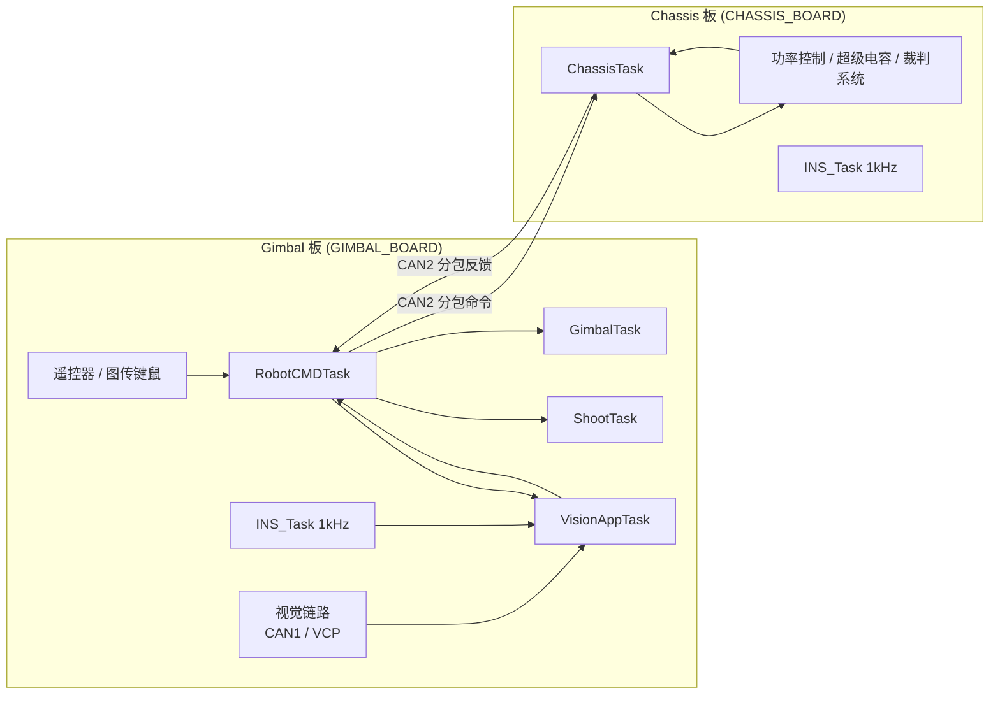

# tau-ref-unified-local 的 Chassis / Gimbal 当前控制链路架构

## 1. 结论先行

当前这个 worktree 不是单板整车，而是标准双板分工：

- `Chassis/application/robot_def.h` 当前定义的是 `CHASSIS_BOARD`
- `Gimbal/application/robot_def.h` 当前定义的是 `GIMBAL_BOARD`

因此当前实际运行架构可以概括为：

- `Gimbal` 板是**控制主板**，负责输入仲裁、视觉接入、云台控制、发射控制，并把底盘命令分包后通过 CAN2 发给底盘板
- `Chassis` 板是**执行底盘板**，负责底盘运动学/动力学控制、功率限制、裁判系统与超级电容接入，并把底盘反馈再通过 CAN2 回传给云台板

源码里虽然仍保留了 `ONE_BOARD` 兼容路径，但这次梳理只按**当前宏配置下真正会走到的链路**描述。

---

## 2. 共用运行骨架

两个工程的系统骨架是一致的：

1. `Src/main.c`
   完成 HAL、时钟、GPIO、CAN、USART、TIM、USB 等基础外设初始化。
2. `application/robot.c -> RobotInit()`
   在关中断阶段完成 `BSPInit()` 和应用层初始化，然后调用 `OSTaskInit()` 创建业务任务。
3. `Src/freertos.c`
   只创建一个 `defaultTask` 做 USB 初始化，随后立即 `osThreadTerminate(NULL)`。
4. 真正长期运行的业务任务都在 `application/robot_task.h` 中创建。

也就是说，`MX_FREERTOS_Init()` 不是业务核心，真正的控制链路入口是：

```text
main()
  -> RobotInit()
    -> BSPInit() + AppInit()
    -> OSTaskInit()
  -> osKernelStart()
```

---

## 3. 当前双板关系图



---

## 4. Chassis 当前控制链路

### 4.1 初始化分层

当前 `Chassis/application/robot.c` 在 `CHASSIS_BOARD` 条件下只会初始化底盘相关应用：

- `RobotInit() -> ChassisInit()`
- 不会调用 `RobotCMDInit()`、`GimbalInit()`、`ShootInit()`

`ChassisInit()` 当前做了这些关键初始化：

- 4 个底盘轮电机，均为 `M3508`，挂在 `CAN1`，ID 为 `1~4`
- 裁判系统 / UI：`UITaskInit(&huart6, &ui_data)`
- 超级电容：`CAN1 tx=0x061 / rx=0x051`
- 板载 IMU：`INS_Init()`
- 双板 CAN 桥：`ChassisCanLinkInit(&hcan2, now_ms)`
- 底盘跟随 PID
- `ChassisForceControl` 力控模块
- `PowerController` 功率限制模块
- `Chassis_SysIDTask` 系统辨识模块

### 4.2 任务拓扑

`Chassis/application/robot_task.h` 当前实际创建的周期任务是：

| 任务 | 周期 | 作用 |
| --- | --- | --- |
| `StartINSTASK` | 1ms / 1kHz | IMU 采样与姿态解算 |
| `StartMOTORTASK` | 1ms / 1kHz | 调用 `MotorControlTask()` 统一下发 DJI 电机控制 |
| `StartDAEMONTASK` | 10ms / 100Hz | 守护、蜂鸣器、离线监控 |
| `StartREFEREETASK` | 1ms / 1kHz | 独立推进裁判串口解析 |
| `StartROBOTTASK` | 2ms / 500Hz | 执行 `RobotTask()`，其中当前只包含 `ChassisTask()` |
| `StartUITASK` | 约 1kHz | UI 发送与刷新 |
| `StartSYSIDTASK` | 1ms / 1kHz | 底盘系统辨识 |

注意：当前底盘主控制链路的**核心业务频率是 500Hz**，不是 1kHz。

### 4.3 业务主链路

当前底盘板的实际控制链按顺序是：

```text
Gimbal 板分包命令
  -> CAN2 / ChassisCanLink
  -> ChassisTask()
  -> 模式选择 + 坐标变换
  -> ChassisForceControl
  -> PowerController
  -> DJIMotorSetEffort()
  -> MotorControlTask()
  -> DJIMotorControl()
  -> CAN1 发给四个 M3508
```

展开后如下：

1. `ChassisTask()` 先调用 `ChassisCanLinkUpdateCommand(&chassis_cmd_recv)`。
   这里从 CAN2 的多路 `CANComm` 实例中恢复控制命令。
2. 如果双板链路离线，则立即强制：
   - `chassis_mode = CHASSIS_ZERO_FORCE`
   - `vx/vy/wz = 0`
   - UI/自瞄标志清零
3. 收到的 `vx/vy` 在这里仍是归一化速度，进入底盘控制前先乘以 `chassis_config.rc.max_linear_speed`。
4. 按模式生成目标旋转速度 `wz`：
   - `CHASSIS_NO_FOLLOW`：`wz = 0`
   - `CHASSIS_FOLLOW_GIMBAL_YAW`：对 `near_center_error` 做跟随 PID，输出角速度参考
   - `CHASSIS_ROTATE`：使用固定小陀螺转速
5. 再根据 `offset_angle` 把“云台坐标系下的速度命令”投影到底盘坐标系。
6. 调用：
   - `ChassisForceControlSetCommand(chassis_vx, chassis_vy, wz)`
   - `ChassisForceControlStep()`

   这一层负责：
   - 底盘速度目标解耦
   - 轮速目标计算
   - 力/扭矩分配
   - 输出轮端目标扭矩 `wheel_tau_ref`
7. 若功率控制开启，则进入 `PowerControllerTask()`：
   - 读取裁判系统功率上限
   - 读取超级电容状态
   - 结合轮端速度/扭矩反馈做在线功率限制
   - 输出限幅后的 `limited wheel_tau_ref`
8. 最终直接通过 `DJIMotorSetEffort()` 把限幅后的扭矩语义写回 4 个 M3508 电机对象。
9. `StartMOTORTASK` 周期性调用 `MotorControlTask()`，其内部调用 `DJIMotorControl()`，真正把控制量通过 CAN1 发给四个轮电机。

### 4.4 回传链路

底盘板执行完控制后会构建 `chassis_feedback_data`，内容主要来自：

- 裁判系统：
  - `chassis_power_limit`
  - `barrel_heat`
  - `barrel_heat_limit`
  - `barrel_cooling_value`
  - `rest_heat`
  - `bullet_speed_limit`
  - `bullet_speed`
- 本地 UI 汇总状态：
  - 链路在线
  - 摩擦轮状态
  - 自瞄状态
  - 卡弹状态
  - 当前发射模式
  - 电容能量

这些数据不会直接广播给本地 `cmd`，而是通过：

- `ChassisCanLinkSendFeedbackIfDue(&chassis_feedback_data)`

按周期回传给 Gimbal 板。

### 4.5 当前架构要点

- 当前底盘板是**纯执行端**，不做本地输入仲裁。
- 当前底盘主线已经统一成“**命令速度 -> 力控 -> 扭矩语义 -> 电机驱动**”。
- `application/cmd/robot_cmd.c` 虽然在仓库中仍存在，但当前 `CHASSIS_BOARD` 配置下不会参与主控制链。

---

## 5. Gimbal 当前控制链路

### 5.1 初始化分层

当前 `Gimbal/application/robot.c` 在 `GIMBAL_BOARD` 条件下实际初始化顺序是：

```text
VisionAppInit()
-> RobotCMDInit()
-> GimbalInit()
-> ShootInit()
-> OSTaskInit()
```

这反映了当前 Gimbal 板的职责顺序：

1. 先建立视觉链路
2. 再建立指令汇聚中心 `robot_cmd`
3. 然后初始化云台执行器
4. 最后初始化发射机构

### 5.2 任务拓扑

`Gimbal/application/robot_task.h` 当前创建的核心任务是：

| 任务 | 周期 | 作用 |
| --- | --- | --- |
| `StartINSTASK` | 1ms / 1kHz | IMU 解算 |
| `StartMOTORTASK` | 1ms / 1kHz | 统一驱动 DJI 电机 |
| `StartDAEMONTASK` | 10ms / 100Hz | 守护与告警 |
| `StartROBOTTASK` | 1ms / 1kHz | 执行 `VisionAppTask -> RobotCMDTask -> GimbalTask -> ShootTask` |
| `StartUITASK` | 条件创建 | 只有 `RefereeTaskIsReady()` 为真才创建 |
| `StartSYSIDTASK` | 1ms / 1kHz | 云台系统辨识 |

此外还有一个很关键的补充：

- `GimbalInit()` 里调用了 `DMMotorControlInit()`
- 这会为每个达妙电机创建独立的 `DMMotorTask`
- 当前 pitch 轴是 DM 电机，因此它不是走 `MotorControlTask()`，而是走**单独的 RTOS 电机任务**

### 5.3 Gimbal 板的四段式控制主线

当前 Gimbal 板可以拆成 4 条局部链路，再汇成一条总控制链。

#### A. 输入仲裁链

```text
遥控器 / 图传键鼠
  -> SelectActiveControlInput()
  -> RC 优先，VTM 次之
  -> RemoteControlSet() / MouseKeySet() / VTMControlSet()
```

当前 `RobotCMDTask()` 会：

1. `RemoteControlProcess()`
2. `VTMInputProcess()`
3. `SelectActiveControlInput()`

仲裁规则很明确：

- RC 在线时优先使用 RC
- RC 不在线但图传在线时切换到 VTM
- 两者都不在线则进入安全停止

#### B. 视觉链

```text
INS_Task 1kHz
  -> VisionSendIMUPacket()
  -> VisionAppTask()
  -> 发布 vision_data
  -> RobotCMDTask / GimbalTask 消费
```

当前视觉链有两个并行方向：

1. **姿态上送视觉端**
   - `INS_Task()` 每 1ms 更新姿态
   - 同时调用 `VisionSendIMUPacket(...)`
   - 当前视觉链默认是 `VISION_LINK_CAN`
   - `VisionAppInit()` 里把视觉链路初始化为 `CAN1`

2. **视觉结果回注控制链**
   - `VisionAppTask()` 订阅 `vision_cmd` 和 `gimbal_feed`
   - 若视觉离线或模式关闭，立即清空输出
   - 若视觉在线且模式有效，则输出 `vision_data`
   - `vision_data` 包含：
     - `vision_valid`
     - `target_locked`
     - `should_fire`
     - `vision_takeover`
     - `yaw_ref_rad / pitch_ref_rad`
     - `yaw_rate_ff_rad_s / pitch_rate_ff_rad_s`

#### C. 指令汇聚链

`RobotCMDTask()` 是整个 Gimbal 板的“控制总调度器”。

它每个周期会做这些事情：

1. 拉取反馈：
   - `chassis_fetch_data`：从底盘板 CAN2 回传
   - `shoot_feed`
   - `gimbal_feed`
   - `vision_data`
2. 做安全状态更新：
   - 输入是否在线
   - VTM pause 是否锁存
   - 是否进入 `ROBOT_STOP`
3. 若未进入 READY，则直接发布安全输出：
   - `gimbal_mode = GIMBAL_ZERO_FORCE`
   - `chassis_mode = CHASSIS_ZERO_FORCE`
   - `shoot_mode = SHOOT_OFF`
   - `vision_mode = VISION_MODE_OFF`
4. 若处于 READY，则继续进入模式设置：
   - `RemoteControlSet()`
   - `MouseKeySet()`
   - `VTMControlSet()`
5. 再执行门控和融合：
   - 热量门控
   - 自动开火门控
   - `VisionControlSet()`
   - UI 摘要打包
6. 最后把命令扇出到三个本地应用和一个远端底盘板：
   - `PubPushMessage(shoot_cmd_pub, ...)`
   - `PubPushMessage(gimbal_cmd_pub, ...)`
   - `PubPushMessage(vision_cmd_pub, ...)`
   - `SendChassisCommandCanIfDue()`

#### D. 执行链

执行层再分为云台和发射两条。

##### 云台执行链

```text
RobotCMDTask
  -> gimbal_cmd
  -> GimbalTask
  -> GimbalRefManagerStep()
  -> Yaw / Pitch 控制器
  -> DJI / DM 电机
```

`GimbalTask()` 的当前结构很清晰：

1. 订阅：
   - `gimbal_cmd`
   - `vision_data`
2. 调用 `GimbalRefManagerStep()` 做参考仲裁：
   - 默认输出手操参考
   - 只有在 `autoaim_mode && vision_takeover` 时才改用视觉参考和视觉前馈
3. 按 `gimbal_mode` 选择控制器：
   - `GIMBAL_ZERO_FORCE`：全部停机
   - `GIMBAL_GYRO_MODE`：Yaw 走 PID 串级，Pitch 走 torque-only MIT
   - `GIMBAL_AUTOAIM_MODE`：参考值切到视觉，执行器主线不变
   - `GIMBAL_LQR_MODE`：Yaw 切到 LQR 控制器，Pitch 仍走扭矩主线
   - `GIMBAL_SYS_ID_CHIRP`：走系统辨识链
4. 输出 `gimbal_feed`

当前执行器配置是：

- Yaw：`GM6020`，走 DJI 电机封装
- Pitch：DM 电机，走 `DMMotorSetEffort()` + 独立 `DMMotorTask`

##### 发射执行链

```text
RobotCMDTask
  -> shoot_cmd
  -> ShootTask
  -> 摩擦轮 / 拨盘状态机
  -> DJIMotorControl()
```

`ShootTask()` 当前控制的是：

- 三个摩擦轮电机：`M3508`
- 一个拨盘电机：`M3508`

其核心职责是：

- 安全停射时统一 stop
- 单发 / 三发时切到角度环
- 连发时切到速度环
- 卡弹恢复时切到反转流程
- 每拍发布 `shoot_feed`

### 5.4 发给底盘板的远程命令链

当前 Gimbal 板不会把底盘控制作为一个大结构体整体发送，而是拆成 4 条 CAN2 通道：

| 通道 | Gimbal 发送 ID | Chassis 接收 ID | 周期 | 内容 |
| --- | --- | --- | --- | --- |
| fast | `0x312` | `0x312` | 10ms / 100Hz | `vx/vy/wz/offset_angle/near_center_error/chassis_mode` |
| state | `0x322` | `0x322` | 50ms / 20Hz | `chassis_speed_buff` |
| ui | `0x332` | `0x332` | 100ms / 10Hz | UI 摘要：摩擦轮、自瞄、卡弹、发射模式 |
| event | `0x342` | `0x342` | 事件触发 | `ui_refresh_request_seq` |

这说明当前架构已经明确区分了：

- 高频运动控制量
- 低频状态量
- UI 摘要量
- 事件触发量

这比早期“整包一次性发过去”的耦合方式更稳，也更容易控总线负载。

---

## 6. 双板回传链路

底盘板回给云台板的反馈当前也被拆成两路：

| 通道 | Chassis 发送 ID | Gimbal 接收 ID | 周期 | 内容 |
| --- | --- | --- | --- | --- |
| fast | `0x311` | `0x311` | 10ms / 100Hz | 裁判在线、剩余热量、枪管热量、冷却值、弹速上限 |
| state | `0x321` | `0x321` | 50ms / 20Hz | `bullet_speed`、`chassis_power_limit` |

Gimbal 侧的 `UpdateChassisFetchDataFromCan()` 会把这两路反馈重新合并到 `chassis_fetch_data`，供：

- `RobotCMDTask()` 的热量门控
- 自动射击门控
- UI 摘要
- 视觉弹速透传

使用。

---

## 7. 板内解耦方式

### 7.1 Gimbal 板内

Gimbal 板内部大量使用 `modules/message_center` 做板内解耦：

- `vision_cmd` / `vision_data`
- `gimbal_cmd` / `gimbal_feed`
- `shoot_cmd` / `shoot_feed`

消息中心的语义是：

- `RegisterPublisher()` / `RegisterSubscriber()` 建立话题
- `PubPushMessage()` 会把数据复制到所有订阅者队列
- 若队列满，则丢弃最旧消息，保留最新消息

所以它更像“**实时控制快照总线**”，而不是严格保序的业务消息队列。

### 7.2 Chassis 板内

当前 `CHASSIS_BOARD` 实际控制主线基本不依赖 `robot_cmd` 本地 pub/sub，而是：

- 远端命令经 `ChassisCanLink`
- 本地控制经 `ChassisTask`
- 本地执行经 `MotorControlTask`

消息中心在底盘板当前更多是给：

- 系统辨识
- 某些历史兼容路径

使用，而不是作为主输入源。

---

## 8. 当前架构的关键特征

### 8.1 明确的主从分板

当前不是“两个板都能下整车指令”，而是：

- Gimbal 板决定“怎么动”
- Chassis 板决定“如何安全地把底盘动出来”

这使得输入、视觉、自瞄逻辑全部集中在 Gimbal 板，底盘板可以聚焦执行与功率控制。

### 8.2 云台链路已经做了“参考仲裁”和“执行解耦”

当前视觉不再直接下电流，而是：

- `VisionAppTask` 只产出参考值和前馈
- `GimbalRefManager` 统一决定谁接管参考
- `GimbalTask` 再把参考送给控制器

这是当前 Gimbal 架构里最干净的一层抽象。

### 8.3 底盘链路已经统一到扭矩语义

当前底盘不是直接从速度命令跳到电流命令，而是：

```text
速度目标
  -> 力控
  -> 轮端扭矩参考
  -> 功率限制
  -> 电机控制
```

这意味着后面继续接 LQR、MPC 或更复杂的能量管理时，接口边界已经比较清楚。

---

## 9. 当前值得注意的实现细节

### 9.1 Gimbal 的 `RobotCMDTask` 注释频率与实际代码不一致

`robot_cmd.c` 里有“200Hz 运行”的旧注释，但当前 `StartROBOTTASK()` 实际是：

- `osDelay(1)`
- 即 1ms / 1kHz

因此本文件应以**任务创建代码**为准，而不是以旧注释为准。

### 9.2 底盘链路在线性主要看 fast 通道

`ChassisCanLinkUpdateCommand()` 返回的在线状态实际是基于 `fast` 通道的 `CANCommIsOnline()`。

这意味着：

- `fast` 掉线会触发整车安全降级
- `state/ui` 掉线则更多表现为默认值回退，而不是直接停机

这是合理的，但在排查“UI 显示不更新、功率档失效、底盘仍能跑”的问题时需要特别注意。

### 9.3 Pitch 轴不走 `MotorControlTask()`

Gimbal 的 pitch 轴当前是 DM 电机：

- 初始化时 `DMMotorControlInit()`
- 运行时走 `DMMotorTask`

所以如果以后要统一统计“所有执行器频率”，不能只盯着 `MotorControlTask()`。

---

## 10. 一句话总结

当前 `tau-ref-unified-local` 的控制架构本质上是：

- **Gimbal 板做“输入/视觉/模式/命令编排”**
- **Chassis 板做“底盘执行/功率控制/状态回传”**
- **板内通过 message center 解耦，板间通过分频分包 CANComm 解耦**

这是一个已经从“单文件堆逻辑”逐步走向“分层控制总线”的架构，当前最核心的两条主线分别是：

- `Gimbal: 输入仲裁 -> 视觉融合 -> gimbal/shoot/chassis 扇出`
- `Chassis: CAN 收命令 -> 力控/功率限制 -> 电机执行 -> CAN 回传反馈`
